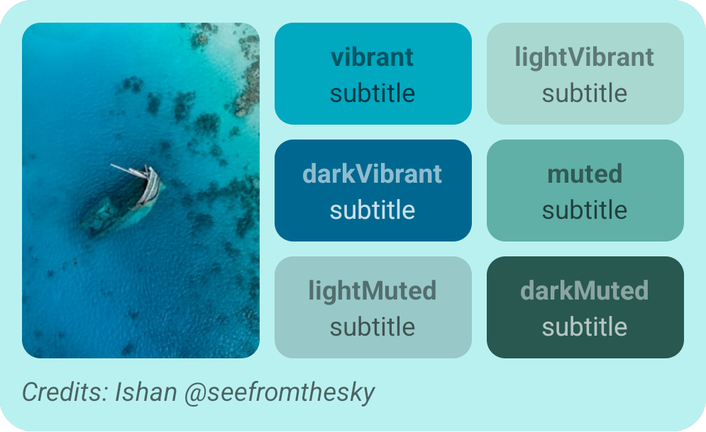
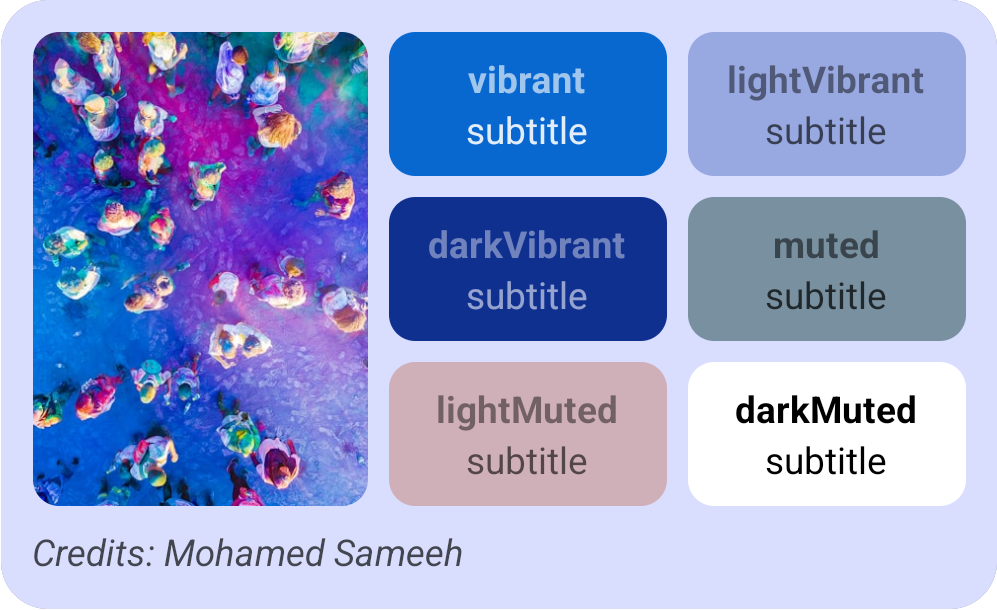
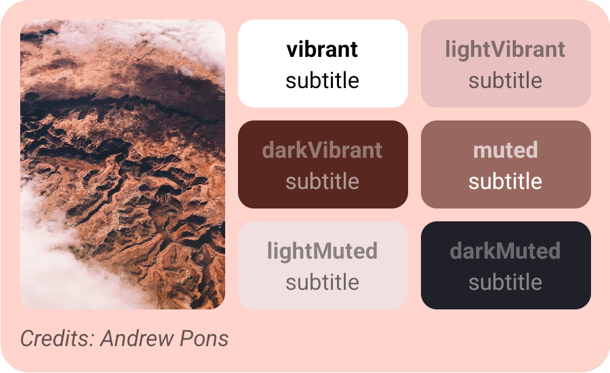
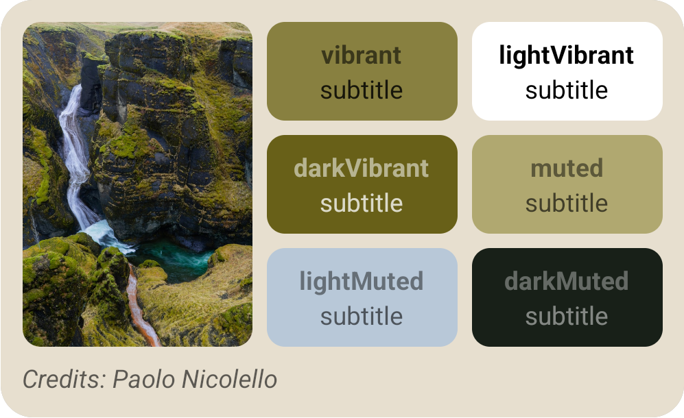

# react-native-material-palette

[![Build Status][build-badge]][build]
[![Code Coverage][coverage-badge]][coverage]
[![Version][version-badge]][package]
[![MIT License][license-badge]][license]

[![PRs Welcome][prs-welcome-badge]][prs-welcome]
[![Chat][chat-badge]][chat]
[![Code of Conduct][coc-badge]][coc]

[Android Palette API](https://developer.android.com/training/material/palette-colors.html) brought to react native. It extracts prominent colors from images to help you create visually engaging apps.

The library only supports Android and requires new architecture to work.






## Installation

```sh
npm install react-native-material-palette
```

## Usage

### `createPalette`

Extract prominent color swatches from an image:

```tsx
import { createPalette } from 'react-native-material-palette';

const palette = await createPalette({ uri: 'https://example.com/photo.jpg' });
```

Or with local image:

```tsx
const palette = await createPalette(require('./photo.jpg'));
```

The returned `PaletteResult` has the following properties, each of which is a `PaletteSwatch` or `undefined`:

| Property       | Description                    |
| -------------- | ------------------------------ |
| `vibrant`      | A vibrant color from the image |
| `lightVibrant` | A light and vibrant color      |
| `darkVibrant`  | A dark and vibrant color       |
| `muted`        | A muted color from the image   |
| `lightMuted`   | A light and muted color        |
| `darkMuted`    | A dark and muted color         |

Each `PaletteSwatch` has the following properties:

| Property         | Type     | Description                                           |
| ---------------- | -------- | ----------------------------------------------------- |
| `color`          | `string` | The main color of the swatch (hex format)             |
| `population`     | `number` | The number of pixels represented by this swatch       |
| `bodyTextColor`  | `string` | A color suitable for body text over the swatch color  |
| `titleTextColor` | `string` | A color suitable for title text over the swatch color |

#### Options

##### `region`

Specifies a rectangular area of the image to use for palette generation. Coordinates are in pixels.

```tsx
const palette = await createPalette(source, {
  region: {
    left: 0,
    top: 0,
    right: 100,
    bottom: 100,
  },
});
```

##### `maximumColorCount`

Maximum colors in the palette. The default value is 16, and the optimal value depends on the source image. For landscapes, optimal values range from 8-16, while pictures with faces usually have values from 24-32.

### `createPaletteForTarget`

Extract a single swatch using a custom target for fine-grained control over color matching:

```tsx
import { createPaletteForTarget } from 'react-native-material-palette';

const swatch = await createPaletteForTarget(source, {
  targetLightness: 0.5,
  minimumLightness: 0.2,
  maximumLightness: 0.8,
  targetSaturation: 0.7,
  minimumSaturation: 0.3,
  maximumSaturation: 1.0,
  lightnessWeight: 0.6,
  saturationWeight: 0.3,
  populationWeight: 0.1,
  exclusive: true,
});
```

It accepts the same `region` and `maximumColorCount` options as `createPalette` in an optional third argument.

### `usePaletteSwatch`

A hook for using palette colors in components. It extracts a single swatch based on the `type` option:

```tsx
import { usePaletteSwatch } from 'react-native-material-palette';

function MyComponent() {
  const swatch = usePaletteSwatch(source, { type: 'vibrant' });

  return (
    <View style={{ backgroundColor: swatch?.color ?? 'white' }}>
      <Text style={{ color: swatch?.bodyTextColor ?? 'black' }}>Hello</Text>
    </View>
  );
}
```

The `type` option can be one of the 6 built-in targets (`'vibrant'`, `'lightVibrant'`, `'darkVibrant'`, `'muted'`, `'lightMuted'`, `'darkMuted'`) or a custom target object.

Returns `undefined` while loading or if generation fails.

> [!TIP]
> To avoid delays due to async palette generation, you can preload the palette by calling `createPalette` with the same image and options ahead of time.

### `Palette.View`

A component that uses a palette swatch color as its background:

```tsx
import { Palette } from 'react-native-material-palette';

function MyComponent() {
  return (
    <Palette.View source={imageSource} type="vibrant">
      {/* your content */}
    </Palette.View>
  );
}
```

It accepts the same options as `usePaletteSwatch` and an optional `fallback` prop with a `PaletteSwatch` to use while loading or if generation fails.

By default, it uses the `color` property of the swatch as its background color. You can customize which swatch color to use with the `variant` prop:

- `color` (default) — main swatch color
- `titleTextColor` — title text color
- `bodyTextColor` — body text color

It renders a regular `View` when not used on Android.

### `Palette.Text`

A component that uses palette swatch colors for text:

```tsx
import { Palette } from 'react-native-material-palette';

function MyComponent() {
  return (
    <Palette.Text source={imageSource} type="vibrant">
      Hello, World!
    </Palette.Text>
  );
}
```

By default, it uses the `bodyTextColor` property of the swatch as its text color. You can customize which swatch color to use with the `variant` prop:

- `color` — main swatch color
- `titleTextColor` — title text color
- `bodyTextColor` (default) — body text color

When nested inside `Palette.View`, it automatically uses the swatch from the parent without needing to provide `source` and `type` props:

```tsx
import { Palette } from 'react-native-material-palette';

function MyComponent() {
  return (
    <Palette.View source={imageSource} type="vibrant">
      <Palette.Text>Hello, World!</Palette.Text>
    </Palette.View>
  );
}
```

The `source` and `type` props can still be provided explicitly to override the parent swatch.

It renders a regular `Text` when not used on Android.

## Contributing

- [Development workflow](CONTRIBUTING.md#development-workflow)
- [Sending a pull request](CONTRIBUTING.md#sending-a-pull-request)
- [Code of conduct](CODE_OF_CONDUCT.md)

## License

MIT

---

Made with [create-react-native-library](https://github.com/callstack/react-native-builder-bob)

<!-- badges -->

[build-badge]: https://github.com/callstack/react-native-material-palette/actions/workflows/ci.yml/badge.svg
[build]: https://github.com/callstack/react-native-material-palette/actions/workflows/ci.yml
[coverage-badge]: https://img.shields.io/coveralls/github/callstack/react-native-material-palette.svg
[coverage]: https://coveralls.io/github/callstack/react-native-material-palette?branch=main
[version-badge]: https://img.shields.io/npm/v/react-native-material-palette.svg
[package]: https://www.npmjs.com/package/react-native-material-palette
[license-badge]: https://img.shields.io/npm/l/react-native-material-palette.svg
[license]: https://opensource.org/licenses/MIT
[prs-welcome-badge]: https://img.shields.io/badge/PRs-welcome-brightgreen.svg
[prs-welcome]: http://makeapullrequest.com
[coc-badge]: https://img.shields.io/badge/code%20of-conduct-ff69b4.svg
[coc]: https://github.com/callstack/react-native-material-palette/blob/main/CODE_OF_CONDUCT.md
[chat-badge]: https://img.shields.io/discord/426714625279524876.svg&colorB=758ED3
[chat]: https://discord.gg/zwR2Cdh
